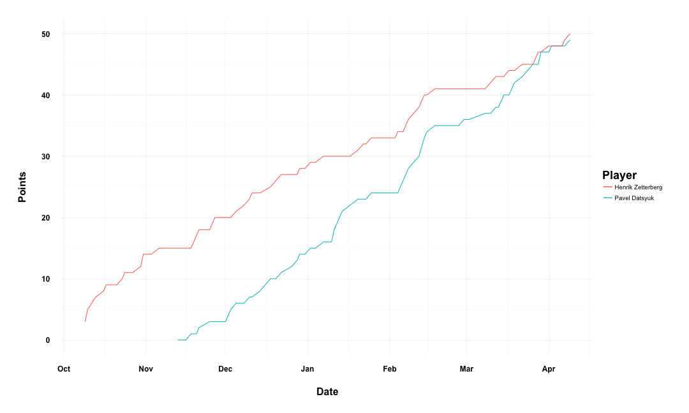
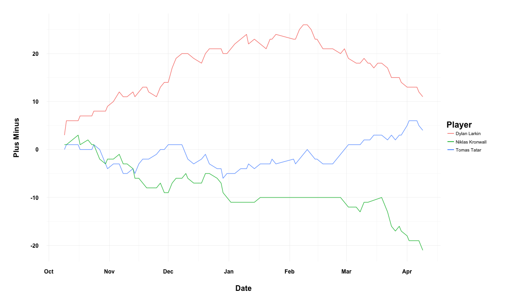

Shiny App Pitch
========================================================
width: 1920
height: 1080
Red Wings Statistics 2015-2016 Season

Author: Sam Terfa

Date: 7-8-16

Overview
========================================================

I have developed a web application which allows the user to
visualize player statistics for the Detroit Red Wings of the
National Hockey League over the entire 2015-2016 season.

The user can...
- select any standard non-goalie statistic for non-goalies
- select as many non-goalies as is desired for comparison
- quickly change selections to update the app as needed

Player Selection
========================================================
Player data is loaded from csv files and the data populates the app.

```r
source("functions.R")

playerData <- getPlayerData()

orderedNames <- orderNames(playerData)

print(head(names(orderedNames)))
```

```
[1] "Justin Abdelkader LW" "Joakim Andersson C"   "Andreas Athanasiou C"
[4] "Pavel Datsyuk C"      "Danny DeKeyser D"     "Jonathan Ericsson D" 
```

Displaying Stats
========================================================
Player data is displayed in graphs using the ggplot2 package.

```r
neatGraphs(playerData, c("Pavel Datsyuk", "Henrik Zetterberg"), "Points")
```



Customizability
========================================================
This is of course fully customizable. The y-axis changes labels and the 
player name labels change automatically.

```r
neatGraphs(playerData, c("Dylan Larkin", "Tomas Tatar", "Niklas Kronwall"), "Plus Minus")
```


